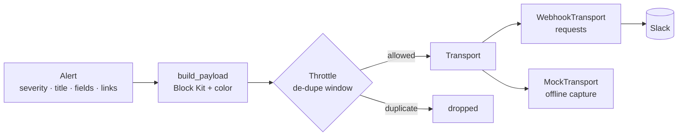

# slack-alert-bot

> Route operational, log, and anomaly alerts to Slack with rich, actionable Block Kit formatting.


## Overview

`slack-alert-bot` turns a structured alert (severity, title, description, fields, links)
into a well-formed Slack [Block Kit](https://api.slack.com/block-kit) payload and delivers
it through an **injectable transport**. Severity drives a color bar and a leading emoji, a
small **throttle** helper suppresses duplicate noise within a time window, and a bundled
`MockTransport` means the whole thing runs — and tests — fully offline with no network and
no real Slack workspace.

It is both a **library** (import `slackalert`) and a **CLI** (`slack-alert-bot`).

## Architecture



The core (`models`, `blocks`, `throttle`) has no I/O. Delivery sits behind a `Transport`
protocol, so real HTTP (`WebhookTransport`) and the offline `MockTransport` are
interchangeable.

## Features

- **Block Kit rendering** — header, description, two-column fields grid, link buttons, and a context footer.
- **Severity → style mapping** — `info` / `warning` / `error` / `critical` each map to a color and emoji.
- **Safe text handling** — untrusted alert content is Slack-escaped (`&`, `<`, `>`) so it can't misrender or inject link markup.
- **Injectable transport** — swap real webhook delivery for `MockTransport` in tests and demos.
- **De-dupe / throttle** — suppress repeat alerts within a rolling window, using an injectable clock (no real sleeps).
- **CLI + library** — build alerts from flags, a JSON file, or Python objects.
- **Offline-first** — `requests` is imported lazily and never touched by the test suite.

## Tech stack

- **Python 3.11**, standard library first
- **requests** — only for real webhook delivery, kept behind the `Transport` seam
- **pytest** — offline tests using `MockTransport` and an injected clock

## Getting started

```bash
git clone https://github.com/matthews-wong/slack-alert-bot.git
cd slack-alert-bot

python -m venv .venv
source .venv/bin/activate        # Windows: .venv\Scripts\activate

pip install -e ".[dev]"
pytest
```

## Usage

### Library (offline with MockTransport)

```python
from slackalert import Alert, AlertClient, MockTransport, Severity, Throttle

alert = Alert(
    severity=Severity.CRITICAL,
    title="Checkout API error rate spike",
    description="Error rate on `checkout-api` crossed *5%* over the last 5 minutes.",
    source="prometheus/checkout-api",
    fields={"Environment": "production", "Error rate": "7.4%", "Threshold": "5.0%"},
    links={"View dashboard": "https://grafana.example.com/d/checkout"},
)

transport = MockTransport()
client = AlertClient(transport, throttle=Throttle(window_seconds=300))
client.send(alert)

print(transport.last)          # the exact Block Kit payload that would hit Slack
client.send(alert)             # duplicate within the window -> returns None, not sent
```

### Real delivery

```python
import os
from slackalert import AlertClient, WebhookTransport

client = AlertClient(WebhookTransport(os.environ["SLACK_WEBHOOK_URL"]))
client.send(alert)
```

### CLI

```bash
# Preview the payload offline — no network, no webhook required:
slack-alert-bot \
  --severity critical \
  --title "Checkout API error rate spike" \
  --description "Error rate crossed *5%*." \
  --field "Region=eu-west-1" --field "Error rate=7.4%" \
  --link "Dashboard=https://grafana.example.com/d/checkout" \
  --mock

# Or from a JSON file:
slack-alert-bot --json examples/alert.json --mock

# Real delivery — set the webhook once, then drop --mock:
export SLACK_WEBHOOK_URL="https://hooks.slack.com/services/XXX/YYY/ZZZ"
slack-alert-bot --json examples/alert.json
```

## Block Kit preview

For a `critical` alert, the tool produces a payload shaped like this
(a single color-barred attachment wrapping the blocks):

```json
{
  "attachments": [
    {
      "color": "#8b0000",
      "fallback": "[CRITICAL] Checkout API error rate spike",
      "blocks": [
        {
          "type": "header",
          "text": { "type": "plain_text", "text": ":rotating_light: Checkout API error rate spike", "emoji": true }
        },
        {
          "type": "section",
          "text": { "type": "mrkdwn", "text": "Error rate on `checkout-api` crossed *5%* over the last 5 minutes." }
        },
        {
          "type": "section",
          "fields": [
            { "type": "mrkdwn", "text": "*Environment*\nproduction" },
            { "type": "mrkdwn", "text": "*Error rate*\n7.4%" }
          ]
        },
        {
          "type": "actions",
          "elements": [
            { "type": "button", "text": { "type": "plain_text", "text": "View dashboard", "emoji": true }, "url": "https://grafana.example.com/d/checkout" }
          ]
        },
        {
          "type": "context",
          "elements": [ { "type": "mrkdwn", "text": "Severity: *CRITICAL*  |  Source: `prometheus/checkout-api`" } ]
        }
      ]
    }
  ]
}
```

Severity color/emoji map:

| Severity   | Color      | Emoji                |
|------------|------------|----------------------|
| `info`     | `#36a64f`  | `:information_source:` |
| `warning`  | `#e8a33d`  | `:warning:`          |
| `error`    | `#e01e5a`  | `:x:`                |
| `critical` | `#8b0000`  | `:rotating_light:`   |

## Project structure

```
slack-alert-bot/
├── slackalert/
│   ├── __init__.py       # public API surface
│   ├── models.py         # Alert, Severity
│   ├── blocks.py         # build Block Kit payload; severity -> color/emoji
│   ├── transport.py      # Transport protocol + WebhookTransport + MockTransport
│   ├── client.py         # AlertClient.send(alert)
│   ├── throttle.py       # de-dupe / rate window (injectable clock)
│   └── cli.py            # CLI entry point (slack-alert-bot)
├── examples/
│   └── alert.json        # sample alert for --json
├── tests/                # pytest, offline, MockTransport only
├── pyproject.toml
├── requirements.txt
├── .github/workflows/ci.yml
├── LICENSE
└── README.md
```

## Testing

```bash
pytest
```

The suite is offline by design: it uses `MockTransport` (never real HTTP) and an injected
clock for the throttle tests (never a real `sleep`). It asserts payload structure, the
severity → color mapping, that `MockTransport` captures what would be sent, and that the
throttle suppresses duplicates within the window.

## Roadmap

- Slack **Web API** transport (`chat.postMessage`) with thread/reply support
- **Interactive buttons** (acknowledge / snooze) via a request-handling receiver
- Pluggable field formatters and templated alert presets

## License

MIT — see [LICENSE](LICENSE). Copyright (c) 2026 Matthews Wong.

---

*Part of my cloud & AI portfolio — see [github.com/matthews-wong](https://github.com/matthews-wong).*
